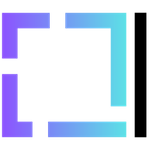

#  SketchPrompt

[See Help & Usage Guide →](HELP.md)

A powerful Cursor IDE extension for visual thinking and AI prompting—best used for quickly sketching ideas and intent to make human-AI collaboration more seamless. Sketch > Copy > Paste into Cursor Chat. Done. Expect more crazy powerful features in the future.

**Website**: [https://sketch-prompt.com](https://sketch-prompt.com)

## Features

- **Rich Sketching**: Full TLDraw integration with shapes, text, drawing tools, and more
- **Robust Auto-Save**: Content-aware saving with debounced operations and file-watching
- **AI-Ready**: Structured JSON format for AI analysis and collaboration
- **File Persistence**: Save and load sketches as `.sketchprompt` files with version control
- **Copy to Prompt**: Export sketches as images and seamlessly insert into your prompts
- **Custom Editor**: Dedicated editor for `.sketchprompt` files with syntax highlighting
- **Real-time Sync**: File-watching with external change detection and auto-reload
- **Collaboration Ready**: Foundation for multi-user and AI-assisted sketching

## Installation

### Option 1: Install SketchPrompt

#### Option 1a: Install from Cursor IDE Extensions
1. Open Cursor IDE
2. Go to Extensions (Cmd/Ctrl + Shift + X)
3. Search for "SketchPrompt"
4. Click Install

#### Option 1b: Install from GitHub Releases
1. Download the latest `.vsix` file from [GitHub Releases](https://github.com/pascalx-git/SketchPrompt/releases)
2. Open Cursor IDE
3. Go to Extensions (Cmd/Ctrl + Shift + X)
4. Click the "..." menu and select "Install from VSIX..."
5. Select the downloaded `.vsix` file
6. Restart Cursor IDE when prompted

### Option 2: For Developers & Contributors
**Build from source to contribute or customize:**
1. Clone this repository: `git clone https://github.com/pascalx-git/SketchPrompt.git`
2. Install dependencies: `npm install`
3. Build the extension: `npm run vscode:prepublish`
4. Package the extension: `npx vsce package`
5. Install the `.vsix` file in Cursor IDE

**Alternative**: Visit [https://sketch-prompt.com](https://sketch-prompt.com) for detailed tutorials and documentation.

## Usage

### Creating a New Sketch

- Open the command palette (`Cmd/Ctrl + Shift + P`)
- Run **"SketchPrompt: New Sketch"**
- Or right-click in the file explorer and select **"SketchPrompt: New Sketch"**
- A new `.sketchprompt` file will be created in the `SketchPrompt` folder
- The file will open in the SketchPrompt editor

### Editing Sketches

- Open any `.sketchprompt` file to edit it visually
- All changes are auto-saved

### Getting Help

- Run **"SketchPrompt: Help"** from the command palette to open the local `Help.md` file in your workspace.
- The `Help.md` file contains usage tips and a link to the [GitHub repo](https://github.com/pascalx-git/SketchPrompt) for the latest updates.
- Visit [https://sketch-prompt.com](https://sketch-prompt.com) for detailed documentation and tutorials.

## Working with .sketchprompt Files

- `.sketchprompt` files are automatically opened in the SketchPrompt editor
- **Smart Auto-Save**: Only saves when content actually changes (not on mouse movement)
- **File Watching**: Automatically reloads when files are modified externally
- **JSON Format**: Files contain structured data that can be version controlled and analyzed by AI

## Development

### Building

```bash
# Build the webview (React app)
npm run build-webview

# Build the extension
npm run compile

# Build both
npm run vscode:prepublish
```

### Watching for Changes

```bash
# Watch webview changes
npm run watch-webview

# Watch extension changes
npm run watch
```

### Testing

1. Press `F5` in Cursor to launch the extension in debug mode
2. Create a new sketch and test the functionality
3. Check the developer console for any errors

## Architecture

- **Extension**: TypeScript-based VS Code extension
- **Webview**: React app with TLDraw integration
- **Build**: Vite for webview bundling, TypeScript for extension compilation
- **Auto-Save**: Debounced, content-aware saving with deep equality checks
- **File Watching**: Self-trigger suppression to prevent reload loops


## Security & Privacy

SketchPrompt follows a security-first development approach with iterative security reviews. We ensure no release ships with major security issues by conducting regular security assessments and addressing vulnerabilities promptly.

**📋 [See detailed security information →](SECURITY.md)**

### **Security Features**
- **Content Security Policy (CSP)**: Hardened against XSS attacks
- **Input Validation**: All sketch data validated with JSON schema
- **Path Traversal Protection**: Secure file operations
- **Error Sanitization**: No information leakage in error messages
- **Local Bundling**: Minimal external dependencies

### **Privacy**

SketchPrompt is designed with privacy in mind. All sketch data stays on your local machine and is never sent to external services.

**What We Don't Track:**
- ❌ **Personal data**: No user names, emails, or identities
- ❌ **Sketch content**: Your drawings and sketches are never sent anywhere
- ❌ **File names**: Individual file names or paths are not tracked
- ❌ **Workspace data**: Your project structure or workspace information
- ❌ **AI conversations**: Chat content or prompts are not tracked

**What's Coming:**
- 🔒 **Local-first approach**: All features will prioritize local processing
- 🤝 **Optional collaboration**: Future sharing features will be opt-in only
- 🔐 **End-to-end encryption**: For any future cloud features
- 📊 **Privacy-focused analytics**: If implemented, will be anonymous and optional

## Roadmap

### Current Focus: Core Extension Features
- Stabilizing the core sketching experience
- Improving auto-save reliability
- Enhancing the file format for better AI integration

### Next Phase: AI-Assisted Sketching
- Integrating AI capabilities to analyze sketches
- Generate prompts and provide intelligent suggestions
- AI-powered content analysis based on visual content

### Future Vision: Real-Time Collaboration
- Multi-user sketching with real-time synchronization
- Conflict resolution and version control
- Cloud-based sharing capabilities

## Dependencies

- `tldraw`: Rich sketching library
- `react` & `react-dom`: UI framework
- `vite`: Build tool for the webview
- `typescript`: Extension development

## License

MIT

## Licensing & Attribution

SketchPrompt is licensed under the MIT License. This project bundles the TLDraw SDK, which is licensed separately by tldraw, Inc. and is subject to its own terms. By using SketchPrompt, you agree to comply with both the MIT License and the TLDraw SDK License.

- [See LICENSE file for full details](LICENSE)
- [TLDraw SDK License](https://tldraw.dev/legal/tldraw-license)

## Contributing

1. Fork the repository
2. Create a feature branch
3. Make your changes
4. Test thoroughly in Cursor
5. Submit a pull request

## Links

- **Website**: [https://sketch-prompt.com](https://sketch-prompt.com)
- **GitHub**: [https://github.com/pascalx-git/SketchPrompt](https://github.com/pascalx-git/SketchPrompt)
- **Help**: Run "SketchPrompt: Help" in Cursor or see [Help.md](Help.md)

---

**Version**: 0.2.0 | **Last Updated**: July 2024 | **Compatibility**: Cursor IDE
